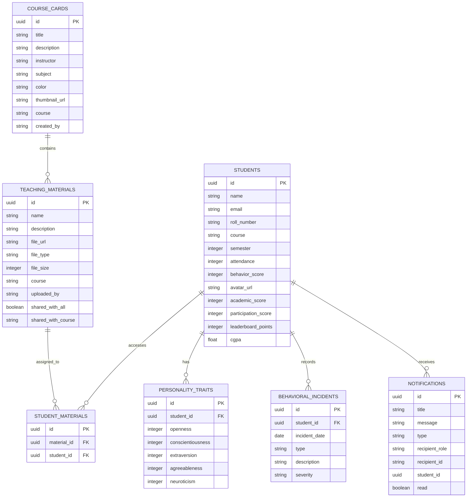
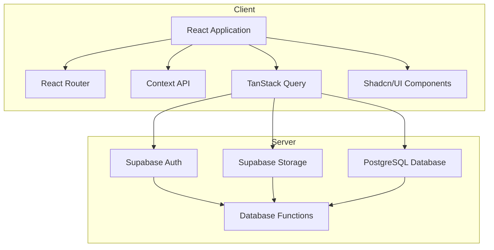
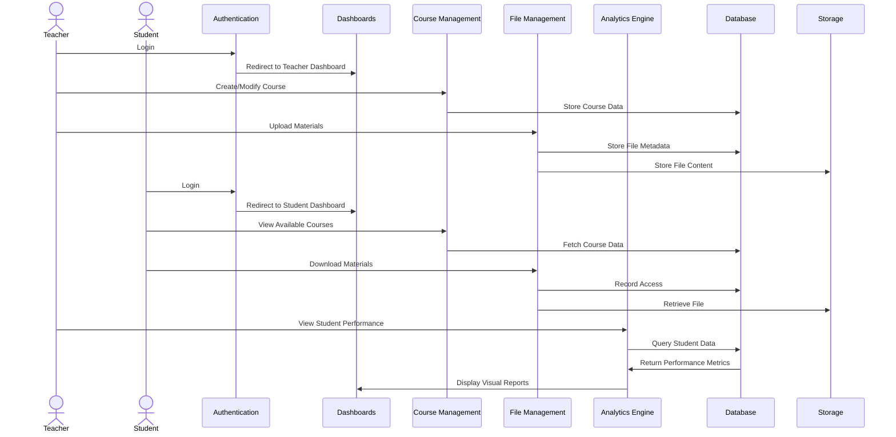

# Automated System for Recording Student Behaviour and Academic Performance

A comprehensive web application for tracking student behavior patterns, academic achievements, and generating insightful educational analytics.

## Overview

The Automated System for Recording Student Behaviour and Academic Performance streamlines assessment workflows for educators and enhances transparency for students. Built with modern web technologies, it provides a seamless interface for behavior tracking, academic performance analysis, file sharing, and comprehensive reporting.

## Key Features

- **Authentication** - Role-based access control with teacher and student portals
- **Dashboards** - Data-driven insights tailored to user roles
- **Course Management** - Create, modify, and organize courses
- **File Management** - Upload, categorize, and share educational materials
- **Student Progress Analytics** - Track attendance, participation, and performance
- **Behavioral Insights** - Monitor and analyze student behavioral patterns
- **Interactive Reporting** - Generate dynamic reports with customizable filters
- **Integrated Calendar** - Schedule classes, assignments, and events
- **Gamified Leaderboard** - Motivate students through achievement recognition
- **Real-time Notifications** - Keep users informed about updates and deadlines

## Tech Stack

### Frontend
- React 18 with TypeScript
- Tailwind CSS with responsive design
- Shadcn/UI for consistent UI elements
- React Context API and TanStack Query for state management
- React Router v6 for routing
- Recharts for data visualization

### Backend
- Supabase PostgreSQL database
- Supabase Auth for authentication
- Supabase Storage for file management
- RESTful API endpoints

## Database Schema



## Application Architecture



## Data Flow



## Getting Started

### Prerequisites
- Node.js 16+ and npm/yarn/bun
- Supabase account and project

### Installation

1. Clone the repository
   ```bash
   git clone https://github.com/yourusername/student-behavior-tracking.git
   cd student-behavior-tracking
   ```

2. Install dependencies
   ```bash
   npm install
   ```

3. Set up environment variables
   ```
   VITE_SUPABASE_URL=your_supabase_url
   VITE_SUPABASE_ANON_KEY=your_supabase_anon_key
   ```

4. Start the development server
   ```bash
   npm run dev
   ```

## Deployment

- **Build Command**: npm run build
- **Framework**: vite
- **Output Directory**: dist

## Contributing

1. Fork the repository
2. Create a feature branch
3. Commit your changes
4. Push to the branch
5. Open a Pull Request
