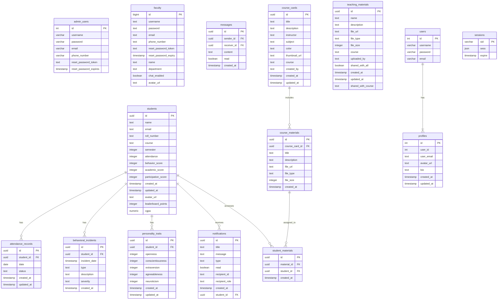

```mermaid
erDiagram

    students {
        uuid id PK
        text name
        text email
        text roll_number
        text course
        integer semester
        integer attendance
        integer behavior_score
        integer academic_score
        integer participation_score
        timestamp created_at
        timestamp updated_at
        text avatar_url
        integer leaderboard_points
        numeric cgpa
    }

    admin_users {
        int id PK
        varchar username
        varchar password
        varchar email
        varchar phone_number
        text reset_password_token
        timestamp reset_password_expires
    }

    faculty {
        bigint id PK
        text username
        text password
        text email
        text phone_number
        text reset_password_token
        timestamp reset_password_expiry
        text name
        text department
        boolean chat_enabled
        text avatar_url
    }

    messages {
        uuid id PK
        uuid sender_id FK
        uuid receiver_id FK
        text content
        boolean read
        timestamp created_at
    }

    notifications {
        uuid id PK
        text title
        text message
        text type
        boolean read
        text recipient_id
        text recipient_role
        timestamp created_at
        uuid student_id FK
    }

    personality_traits {
        uuid id PK
        uuid student_id FK
        integer openness
        integer conscientiousness
        integer extraversion
        integer agreeableness
        integer neuroticism
        timestamp created_at
        timestamp updated_at
    }

    attendance_records {
        uuid id PK
        uuid student_id FK
        date date
        text status
        timestamp created_at
        timestamp updated_at
    }

    behavioral_incidents {
        uuid id PK
        uuid student_id FK
        timestamp incident_date
        text type
        text description
        text severity
        timestamp created_at
    }

    course_cards {
        uuid id PK
        text title
        text description
        text instructor
        text subject
        text color
        text thumbnail_url
        text course
        text created_by
        timestamp created_at
        timestamp updated_at
    }

    course_materials {
        uuid id PK
        uuid course_card_id FK
        text title
        text description
        text file_url
        text file_type
        integer file_size
        timestamp created_at
    }

    student_materials {
        uuid id PK
        uuid material_id FK
        uuid student_id FK
        timestamp created_at
    }

    teaching_materials {
        uuid id PK
        text name
        text description
        text file_url
        text file_type
        integer file_size
        text course
        text uploaded_by
        boolean shared_with_all
        timestamp created_at
        timestamp updated_at
        text shared_with_course
    }

    profiles {
        int id PK
        int user_id
        text user_email
        text avatar_url
        text bio
        timestamp created_at
        timestamp updated_at
    }

    users {
        int id PK
        varchar username
        varchar password
        varchar email
    }

    sessions {
        varchar sid PK
        json sess
        timestamp expire
    }

    students ||--o{ attendance_records : has
    students ||--o{ behavioral_incidents : has
    students ||--o{ personality_traits : has
    students ||--o{ notifications : receives
    students ||--o{ student_materials : accesses
    course_cards ||--o{ course_materials : includes
    course_materials ||--o{ student_materials : assigned_to
    users ||--|{ profiles : has

```
